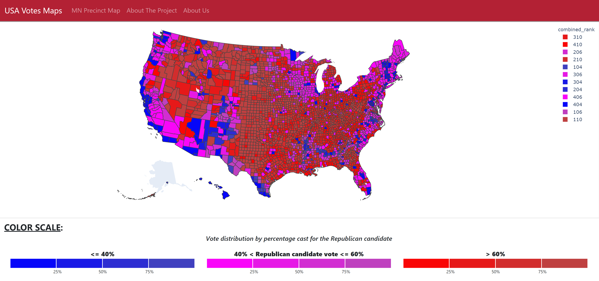

<i>Home Screen</i>

# Election Breakdown     
#### <i>Looking at the 2016 Presidential Election voting breakdown, based on party-votes and total ballots casts</i>               
Given how politically fraught the U.S. currently feels, we wanted to explore just how partisan the country actually is.  To answer that question, we looked at what the actual vote tallies were, broken down by Republican and Democrat.  It can feel like the country is intensely either-or.  Either you're a Democrat.  Or you're a Republican.  But we hypothesized that the country is overwhelmingly "purple."  With this project, we strove to show that the people of the U.S. are more similar than not by the diversity of the vote tallies.

## Files Included in This Repo:     
<i>We have many files included in this repo which you will not need if you choose to clone it.  So these are the files you'll need to focus on.</i>      
* <b>Assets folder</b> which contains the `style.css`.
* <b>Resources folder</b> containing the various voting data in CSV format, along with shapefiles used for both MN precincts and US counties.
* <b>Templates folder</b> containing the various html pages, of which there are four.
* <b>Flask app</b> `flask_app.py` which is the basic router gets called in both the final `run.py` file and `wsgi.py` file
* <b>Two Dash apps</b> (counties_app.py, precinct_app.py) which contain the code to create both the county and MN precinct maps.
* Overall <b>run.py file</b> which calls the above three files.
* <b>WSGI.py file</b>, which is Django's primary deployment platform.      

## Clone and Run the Repo:
1. Clone to your desktop
2. Install Dash with the command `pip install dash==1.19.0` if you don't already have it installed in your virtual environment. (Dash is being updated regularly, so this might change as time goes on.  Website listed below).       
3. Put your mouse over the folder where this repo is cloned on your computer, right click, click on 'Git Bash Here' to pull up the Git Bash terminal
4. Move to the same level as run.py and type `python run.py` into the terminal 
5. Then right-click on index.html and click Open.  The previous command (#4) takes a little time, so the map won't appear right away.
6. Voila!

##### You'll notice various jupyter notebooks listed among our files.  This is where we did some pre-coding before putting it into the Flask/Dash framework.     

Dash website: https://dash.plotly.com/installation      
MN precinct voting data: https://www.sos.state.mn.us/elections-voting/election-results/2016/2016-general-election-results/2016-precinct-results-spreadsheet/     
MN precinct shapefiles: https://www.sos.state.mn.us/election-administration-campaigns/data-maps/voting-precincts/        
US Voting Data: https://electionlab.mit.edu/data    

 
